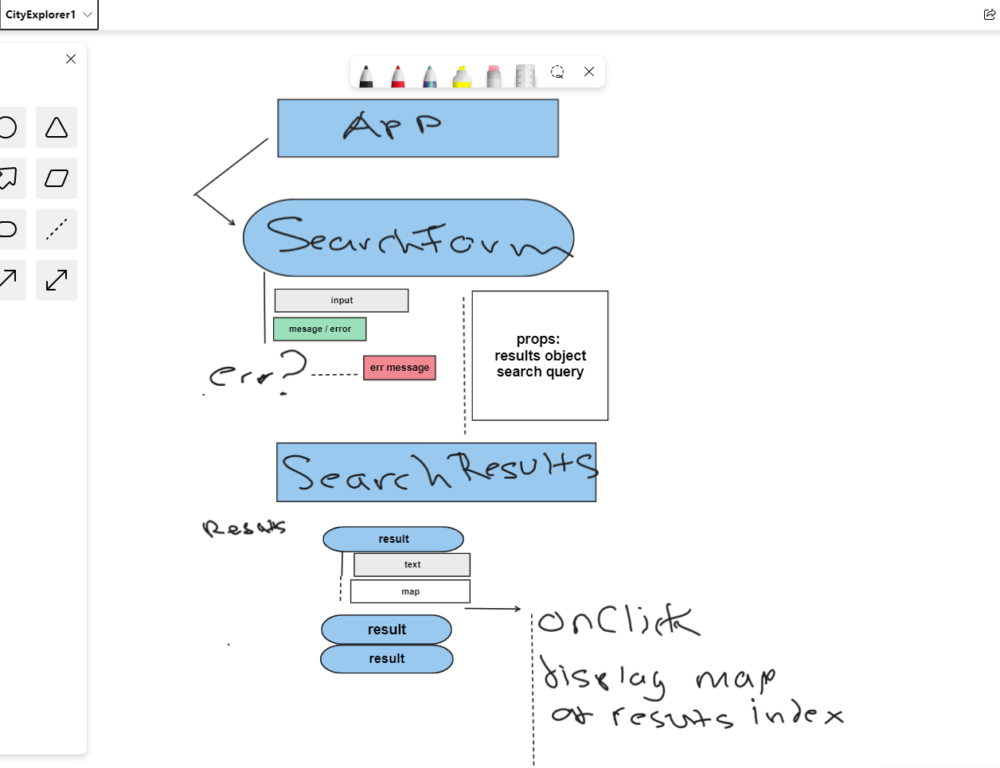

# City Explorer

**Author**: Ethan Storm
**Version**: 1.0.6 (increment the patch/fix version number if you make more commits past your first submission)

## Overview

- Code fellows 301 class lab, create a website that can display information and maps about cities that users search.
- Users need a reliable place to lookup information about cities they are in now, or will be later. This app provides an all in one for information about weather, maps, and more!

## Getting Started

- Clone the repository into a folder called city-explorer. Open the folder in VS-Code and run npm install from root directory (/city-explorer). After install is complete run npm start to open the app in local dev environment!

## Architecture

<!-- Provide a detailed description of the application design. What technologies (languages, libraries, etc) you're using, and any other relevant design information. -->

- This app is built with ReactJS, NodeJS, and multiple API's that provide information for geography, weather, location, and more!

## Change Log

01-01-2001 4:59pm - Application now has a fully-functional express server, with a GET route for the location resource. -->

- 02-20-2023 12:29pm - Initial commit of CRA and readme.
- 02-20-2023 4:30pm - added button to test and debug API calls server/client
- 02-20-2023 5:10pm - added search form component
- 02-20-2023 5:36pm - added search results component
- 02-20-2023 5:53pm - added error messages for users
- 02-20-2023 6:21pm - added map to selected location
- 02-20-2023 6:51pm - improved styling, added animations

- 02-21-2023 12:30pm - updated readme and branched for weather api
- 02-21-2023 5:04pm - finished all requirements to add server requests to client

- 02-22-2023 10:00am - branched for refactoring weather and adding movie API
- 02-22-2023 10:50am - implemented proper weather api in front and back end
- 02-22-2023 11:30am - added locationInfo component to write cleaner code
- 02-22-2023 11:50am - implemented locationInfo successfully
- 02-22-2023 2:45pm - adds successful movie queries and display
- 02-22-2023 4:07pm - adds support for when request limit is reached
- 02-22-2023 4:31pm - updates request routes
- 02-22-2023 5:45pm - finished deployment

- 02-23-2023 7:50am - branched for refactoring
- 02-23-2023 8:15am - commented code getting ready to add new component
- 02-23-2023 8:21am - added result component for cleaner code
- 02-23-2023 8:31am - added search bar component for cleaner code
- 02-23-2023 9:58am - fixes weather request, providing multiple forecasts
- 02-23-2023 10:05am - adds weekday date to weather component

## Credit and Collaborations

Day one planned with:

- [Darran Holmes](https://github.com/darranholmes74)

